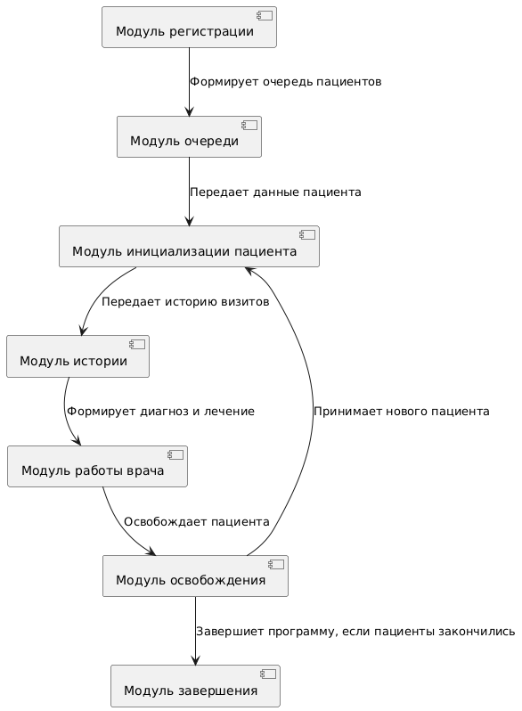

# Учебная программа "Очередь пациентов" 

# 1. ОПИСАНИЕ ПРОГРАММЫ

## 1.1. Назначение программы  
Программа «Очередь пациентов» предназначена для автоматизации процессов:  
- Управления очередью на прием к врачу;  
- Ведения истории посещений пациентов.  

**Область применения**: поликлиники, больницы, частные медицинские центры.

---

## 1.2. Функциональные характеристики  
Программа обеспечивает выполнение следующих функций:  
1. **Управление очередью**:  
   - Вызов следующего пациента к врачу.  

2. **Ведение истории посещений**:  
   - Фиксация диагноза и назначенных препаратов;  
   - Просмотр истории визитов.  

**Входные данные**:  
| Параметр         | Тип               | Описание                  |  
|-------------------|-------------------|---------------------------|  
| Специальность врача| Строка            | Специальность  врача, принимающего записанных к нему клиентов|  

**Выходные данные**:  
| Параметр         | Тип               | Описание                  |  
|-------------------|-------------------|---------------------------|  
| Полная информация о пациенте  | Строка       |  ФИО пациента, дата рождения, пол|  
| История визитов   | Массив строк      | Список посещений с диагнозами и препаратами |  

---

## 1.3. Условия применения  
**Требования к аппаратному обеспечению**:  
- Процессор: не менее 1 ГГц;  
- ОЗУ: 2 ГБ;  
- Свободное место на диске: 100 МБ.  

**Программное окружение**:
- ОС: Windows 10/11, Linux (Ubuntu 22.04+), MacOS;
- Хранение данных: текстовые файлы (CSV, в том числе `patients_all.csv` для архива пациентов);
- Вся логика программы теперь находится в одном файле `patient_queue.cpp`.

---

## 1.4. Структура программы  
Программа имеет следующую диаграмму классов: 

Программа состоит из следующих модулей: 

1. Модуль регистрации проводит авторизацию и аутентификацию пользователя. Если все прошло успешно, программа готова к работе с локальными файлами.
2. Модуль очереди формирует очередь пациентов из таблицы с записанными ко врачу людьми.
3. Модуль инициализации пациента берет верхнего пациента из очереди и выводит его личные данные на экран.
4. Модуль истории выводит на экран историю болезней у пациента и выписанные в прошлом лекарства.
5. Модуль работы врача сохраняет в файл информацию о текущей болезни пациента и назначенных ему лекарствах.
6. Модуль освобождения удаляет из очереди и таблицы с очередью пациента, прием которого был завершен. После этого вызывается модуль инициализации для следующего пациента, при его наличии, либо программа переходит к завершению.
7. Модуль завершения закрывает программу.
